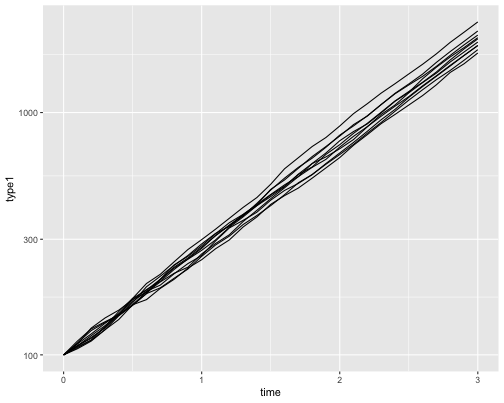
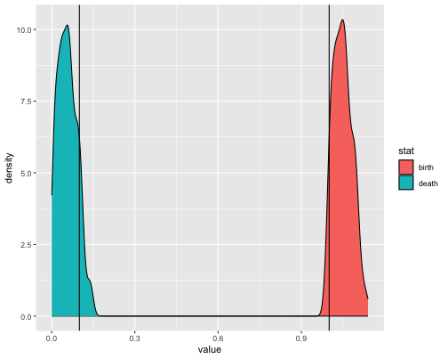
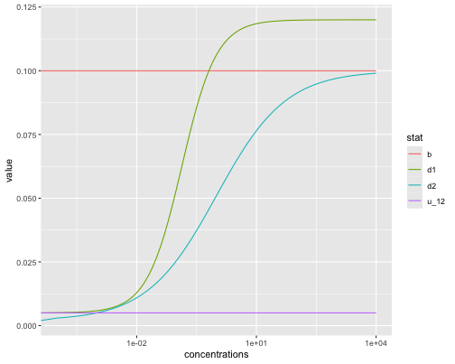
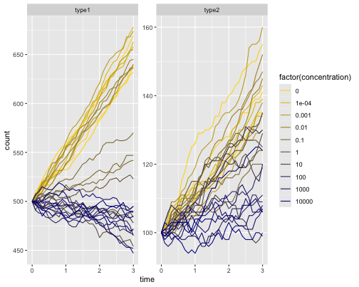

``` r
library(bestdr)
library(tidyverse)
```

# Introduction

BESTDR can create custom models where you can specify the mechanistic model that
describes how each type reproduces, dies, transitions, etc. We specify each event
as a transition where the parent, offspring, and concentration-response are
all explicitly stated. Additionally we can include any parameter constraints,
prior information, hierarchical variables and priors, as well as whether or not
to include an error term. A couple steps and functions are required to go from model
specification to creating the Stan file that can be compiled. We include helper
functions to add data.

This vignette will use the birth-death process as an example and increase the complexity
of the modeling to account for a single concentration (no dose-response), a dose-response
model, and a hierarchical dose-response model. We use the `estipop` library

# Single-type birth-death process (no dose-response)

We first simulate data from a single type birth-death process to estimate the birth
and death rate without a dose-response model.


``` r
b <- 1
d <- 0.1

N <- 10 # Number of samples
tot_time <- 3
dt <- 0.1 # Time between measurements
times <- seq(0, tot_time, dt)
init_pop <- c(100) # Number of ancestors

set.seed(90210)
params <- c(b, d)
model <- estipop::process_model(
  estipop::transition(rate = estipop::rate(params[1]), parent = 1, offspring = c(2)), # birth
  estipop::transition(rate = estipop::rate(params[2]), parent = 1, offspring = c(1)) # death
)
dat <- estipop::branch(model, params, init_pop, times, N, silent = T)

# Plot the longitudinal cell growth data
dat %>% ggplot(aes(x = time, y = type1, group = rep)) +
  geom_line() +
  scale_y_log10()
```



We use the `process_model` function in BESTDR to put all the pieces of the model together.
The required argument is a `bp_model` that lists the transitions that define the branching
process model. A transition must have a parent, the offpsring vector, and can include the
dose-response function. In the following example we allow the live cell to either split
into 2 offspring (transition1 - called "birth") or it can die and beget 0 offspring
(transition2 - called "death"). We explicitly set our priors for the "birth" and "death"
rate as coming from a normal distribution with mean `mu_b` and standard deviation
`s_b`. The brackets indicate that the standard deviation term is constrained to be
positive. Additionally, we added that the birth and death rates are both constrainted to
be positive as well since these represent rates and should not be less than 0. Finally we
add that there is no observation error expected in the model.


``` r
model <- process_model(
  bp_model(transition(name = "birth", parent = 1, offspring = c(2)), # birth
           transition(name = "death", parent = 1, offspring = c(0))), # death
  priors = c(
    "birth ~ normal(mu_b, s_b[0,])",
    "death ~ normal(mu_d, s_d[0,])"
  ),
  parameter_constraints = c("birth[0,]", "death[0,]"),
  observation_error = FALSE
)

mystancode <- create_stan_code(model)
f2 <- write_stan_file(mystancode)
stanmodel <- cmdstanr::cmdstan_model(f2, force_recompile = T)
```

To run the model, we create the Stan code from the information above using `create_stan_code`
which parses the information from the model and inserts it into a template, but does not
compile. We can write the code to a file with `write_stan_file` which defaults to a
temporary directory, but can be set if additional modifications might be needed that are
beyond the scope of simple functions (see the model library for some different changes).

The data needs to be in the form of an R dataframe and contain the current and previous counts
for all types as individual columns as well as a time variable that provides the time between
observations. We call the modified dataset `dat_dt` in the following chunk:

``` r
head(dat)
#>   rep time type1
#> 1   1  0.0   100
#> 2   1  0.1   109
#> 3   1  0.2   117
#> 4   1  0.3   130
#> 5   1  0.4   147
#> 6   1  0.5   169
```

``` r
dat_dt <- dat %>% group_by(rep) %>%
  mutate(dt = time - lag(time),
         type1_prev = lag(type1)) %>%
  filter(!is.na(dt))
dat_dt <- as.data.frame(dat_dt)
head(dat_dt)
#>   rep time type1  dt type1_prev
#> 1   1  0.1   109 0.1        100
#> 2   1  0.2   117 0.1        109
#> 3   1  0.3   130 0.1        117
#> 4   1  0.4   147 0.1        130
#> 5   1  0.5   169 0.1        147
#> 6   1  0.6   186 0.1        169
```

To attach the data, we need to specify the names of the variables for the time interval as
well as the counts. The function `attach_data` allows us to specify this information and outputs
the dataset that can be used for model fitting. Additionally we'll specify the priors for the
parameters as well as the initialization function which are part of `cmdstanr`.


``` r
data.list <- attach_data(model, dat_dt,
                         time_var = "dt",
                         count_vars = "type1",
                         prevcount_vars = "type1_prev")


prior.list <- list(
  mu_b = 1,
  s_b = 0.3,
  mu_d = 1,
  s_d = 0.5
)

initfun <- function() {
  list(
    birth = runif(1, 0, 2),
    death = runif(1, 0, 2),
    count_err = runif(data.list$N, -0.5, 0.5)
  )
}
```

Running the code is done using the sample function and provides posterior draws
from the HMC sampler that we can compare to the original estimates.

``` r
model_posterior <- stanmodel$sample(
  data = c(data.list, prior.list),
  chains = 1,
  parallel_chains = 1,
  refresh = 0,
  init = initfun,
  iter_warmup = 200,
  iter_sampling = 200
)
#> Running MCMC with 1 chain...
#> 
#> Chain 1 finished in 4.5 seconds.
```

``` r

model_posterior$summary(variables = c("birth", "death"))
#> # A tibble: 2 × 10
#>   variable   mean median     sd    mad      q5   q95  rhat ess_bulk ess_tail
#>   <chr>     <dbl>  <dbl>  <dbl>  <dbl>   <dbl> <dbl> <dbl>    <dbl>    <dbl>
#> 1 birth    1.05   1.05   0.0338 0.0366 1.00    1.10   1.01     143.     185.
#> 2 death    0.0569 0.0563 0.0340 0.0392 0.00881 0.113  1.00     142.     113.
```

``` r
params_posterior <- model_posterior$draws(variables = c("birth", "death"), format = "df")

true_data <- data.frame(stat = c("birth", "death"), value = c(b, d))
params_posterior %>%
  pivot_longer(c("birth", "death"), names_to = "stat", values_to = "value") %>%
  ggplot(aes(x = value, fill = stat)) +
  geom_density() +
  geom_vline(data = true_data, aes(xintercept = value))
```




# 2-type birth-death-mutation process
We show an example from a multitype process with a concentration response model. The
process is a 2-type process of "sensitive" and "resistant" cells where the increase
in concentration of the drug leads to an increase in the death rate. The birth rate
of both types are the same and the mutation rate is the same.


``` r
b <- 0.10

d0_1 <- 0.005
di_1 <- 0.12
d50_1 <- -2
dh_1 <- 1
dd_1 <- di_1 - d0_1

d0_2 <- 0.002
di_2 <- 0.10
d50_2 <- 0
dh_2 <- 0.5
dd_2 <- di_2 - d0_2

u_12 <- 0.005
```


We simulate the process for each of the concentrations for 3 replicates.

``` r
d_curve <- function(lc, d0, dd, dh, d50) d0 + dd - dd / (1 + exp(dh * (lc - d50)))

concentrations <- c(0, 10^seq(-4, 4, 1))
log_conc <- log(concentrations)
d1_truth <- d_curve(log_conc, d0_1, dd_1, dh_1, d50_1)
d2_truth <- d_curve(log_conc, d0_2, dd_2, dh_2, d50_2)

N <- 3 # Number of samples
tot_time <- 3
dt <- 0.1 # Time between measurements
times <- seq(0, tot_time, dt)
init_pop <- c(500, 100) # Number of ancestors

# Simulate process with estipop
set.seed(29837)
dat <- data.frame()
for (i in seq_along(concentrations)) {
  params <- c(b, d1_truth[i], u_12, b, d2_truth[i])
  # time-homogeneous two-type model
  model <- estipop::process_model(
    estipop::transition(rate = estipop::rate(params[1]), parent = 1, offspring = c(2, 0)), # 1 birth
    estipop::transition(rate = estipop::rate(params[2]), parent = 1, offspring = c(0, 0)), # 1 death
    estipop::transition(rate = estipop::rate(params[3]), parent = 1, offspring = c(0, 1)), # mutation
    estipop::transition(rate = estipop::rate(params[4]), parent = 2, offspring = c(0, 2)), # 1 birth
    estipop::transition(rate = estipop::rate(params[5]), parent = 2, offspring = c(0, 0))  # 1 death
  )
  
  dat_temp <- estipop::branch(model, params, init_pop, times, N, silent = T)
  dat_temp$concentration <- concentrations[i]
  dat <- dplyr::bind_rows(dat, dat_temp)
}

dat %>% pivot_longer(c(type1, type2), names_to = "type", values_to = "count") %>%
  ggplot(aes(x = time, y = count, color = factor(concentration),
             group = interaction(rep, factor(concentration)))) +
  geom_line() +
  scale_color_manual(values = colorRampPalette(c("gold", "darkblue"))( 10 )) +
  facet_wrap(type ~ ., scales = "free_y")
```



Model Definition Block

``` r
model <- process_model(
  bp_model(transition(name = "birth_1", parent = 1, offspring = c(2, 0)),
           transition(name = "death_1", parent = 1, offspring = c(0, 0),
                      model = "death_1 ~ d0_1 + dd_1  - dd_1 / (1 + exp(dh_1 * (x - d50_1)))"),
           transition(name = "mut_12", parent = 1, offspring = c(0, 1)),
           transition(name = "birth_2", parent = 1, offspring = c(0, 2)),
           transition(name = "death_2", parent = 1, offspring = c(0, 0),
                      model = "death_2 ~ d0_2 + dd_2  - dd_2 / (1 + exp(dh_2 * (x - d50_2)))")),
  parameter_constraints = c("birth_1[0,]", "birth_2[0,]", "mut_12[0,]",
                            "d0_1[0,]", "dd_1[0,]", "dh_1[0,]",
                            "d0_2[0,]", "dd_2[0,]", "dh_2[0,]"),
  priors = c(
    "birth_1 ~ normal(mu_b1, s_b1[0,])",
    "birth_2 ~ normal(mu_b2, s_b2[0,])",
    "mut_12 ~ normal(mu_u, s_u[0,])",
    "d0_1 ~ normal(mu_d0_1, s_d0_1[0,])",
    "dd_1 ~ normal(mu_dd_1, s_dd_1[0,])",
    "d50_1 ~ normal(mu_d50_1, s_d50_1[0,])",
    "dh_1 ~ normal(mu_dh_1, s_dh_1[0,])",
    "d0_2 ~ normal(mu_d0_2, s_d0_2[0,])",
    "dd_2 ~ normal(mu_dd_2, s_dd_2[0,])",
    "d50_2 ~ normal(mu_d50_2, s_d50_2[0,])",
    "dh_2 ~ normal(mu_dh_2, s_dh_2[0,])"
  ),
  predictor_names = "x",
  observation_error = FALSE
)
mystancode <- create_stan_code(model)
f2 <- write_stan_file(mystancode)
stanmodel <- cmdstanr::cmdstan_model(f2, force_recompile = T)
```

The code can then be run by filling out the priors and sampling as below (not run):

``` r
prior.list <- list(
  mu_b1 = 0.1,
  s_b1 = 0.05,
  mu_b2 = 0.1,
  s_b2 = 0.05,
  mu_u = 0.01,
  s_u = 0.02,
  mu_d0_1 = 0.01,
  s_d0_1 = 0.1,
  mu_dd_1 = 0.1,
  s_dd_1 = 0.1,
  mu_d50_1 = 0,
  s_d50_1 = 1,
  mu_dh_1 = 1,
  s_dh_1 = 1,
  mu_d0_2 = 0.01,
  s_d0_2 = 0.1,
  mu_dd_2 = 0.1,
  s_dd_2 = 0.1,
  mu_d50_2 = 0,
  s_d50_2 = 1,
  mu_dh_2 = 1,
  s_dh_2 = 1
)

model_posterior <- stanmodel$sample(
  data = c(data.list, prior.list),
  chains = 1,
  parallel_chains = 1,
  refresh = 1,
  #init = initfun,
  iter_warmup = 500,
  iter_sampling = 500
)

model_posterior$summary()
params_posterior <- model_posterior$draws(variables = c("birth", "death"), format = "df")
```

Suppose we have data from multiple cell lines (or groups) and we wish to perform the same model
with a group effect where we believe the birth rate and death curve for the first type have differences
between the cell lines. We can include this effect by adding the "hierarchical" argument and specifying
the variables that apply as in the following block:


``` r
model <- process_model(
  bp_model(transition(name = "birth_1", parent = 1, offspring = c(2, 0)),
           transition(name = "death_1", parent = 1, offspring = c(0, 0),
                      model = "death_1 ~ d0_1 + dd_1  - dd_1 / (1 + exp(dh_1 * (x - d50_1)))"),
           transition(name = "mut_12", parent = 1, offspring = c(0, 1)),
           transition(name = "birth_2", parent = 1, offspring = c(0, 2)),
           transition(name = "death_2", parent = 1, offspring = c(0, 0),
                      model = "death_2 ~ d0_2 + dd_2  - dd_2 / (1 + exp(dh_2 * (x - d50_2)))")),
  parameter_constraints = c("birth_1[0,]", "birth_2[0,]", "mut_12[0,]",
                            "d0_1[0,]", "dd_1[0,]", "dh_1[0,]",
                            "d0_2[0,]", "dd_2[0,]", "dh_2[0,]"),
  priors = c(
    "birth_1 ~ normal(mu_b1, s_b1[0,])",
    "birth_2 ~ normal(mu_b2, s_b2[0,])",
    "mut_12 ~ normal(mu_u, s_u[0,])",
    "d0_1 ~ normal(mu_d0_1, s_d0_1[0,])",
    "dd_1 ~ normal(mu_dd_1, s_dd_1[0,])",
    "d50_1 ~ normal(mu_d50_1, s_d50_1[0,])",
    "dh_1 ~ normal(mu_dh_1, s_dh_1[0,])",
    "d0_2 ~ normal(mu_d0_2, s_d0_2[0,])",
    "dd_2 ~ normal(mu_dd_2, s_dd_2[0,])",
    "d50_2 ~ normal(mu_d50_2, s_d50_2[0,])",
    "dh_2 ~ normal(mu_dh_2, s_dh_2[0,])",
    
    "mu_b1 ~ normal(theta_1_mu_birth1, theta_2_mu_birth1)",
    "s_b1 ~ normal(theta_1_s_birth1, theta_2_s_birth1)",
    "mu_d0_1 ~ normal(theta_1_mu_d0_1, theta_2_mu_d0_1)",
    "s_d0_1 ~ normal(theta_1_s_d0_1, theta_2_s_d0_1)",
    "mu_dd_1 ~ normal(theta_1_mu_dd_1, theta_2_mu_dd_1)",
    "s_dd_1 ~ normal(theta_1_s_dd_1, theta_2_s_dd_1)",
    "mu_d50_1 ~ normal(theta_1_mu_d50_1, theta_2_mu_d50_1)",
    "s_d50_1 ~ normal(theta_1_s_d50_1, theta_2_s_d50_1)",
    "mu_dh_1 ~ normal(theta_1_mu_dh_1, theta_2_mu_dh_1)",
    "s_dh_1 ~ normal(theta_1_s_dh_1, theta_2_s_dh_1)"
  ),
  hierarchical = c("birth_1", "d0_1", "dd_1", "d50_1", "dh_1"),
  predictor_names = "x",
  observation_error = FALSE
)
```

Note: For a 1-type birth-death process model, you currently need to specify a dose-response
model for each parameter in a hierarchical component.
Ex.

``` r
model <- process_model(
  bp_model(transition(name = "birth", parent = 1, offspring = c(2), model = "birth ~ bi + db / (1 + exp(bh * (x - b50)))"), # birth
           transition(name = "death", parent = 1, offspring = c(0), model = "death ~ ddeath")), # death
  priors = c(
    "bi ~ normal(prior_mu_bi, prior_s_bi[0,])",
    "db ~ normal(prior_mu_db, prior_s_db[0,])",
    "b50 ~ normal(prior_mu_b50, prior_s_b50[0,])",
    "bh ~ normal(prior_mu_bh, prior_s_bh[0,])",
    "ddeath ~ normal(d1, d2)",
    "d1 ~ normal(prior_mu_d1, prior_s_d1)",
    "d2 ~ normal(prior_mu_d2, prior_s_d2)"
  ),
  observation_error = FALSE,
  predictor_names = "x",
  hierarchical = "ddeath"
)
```
